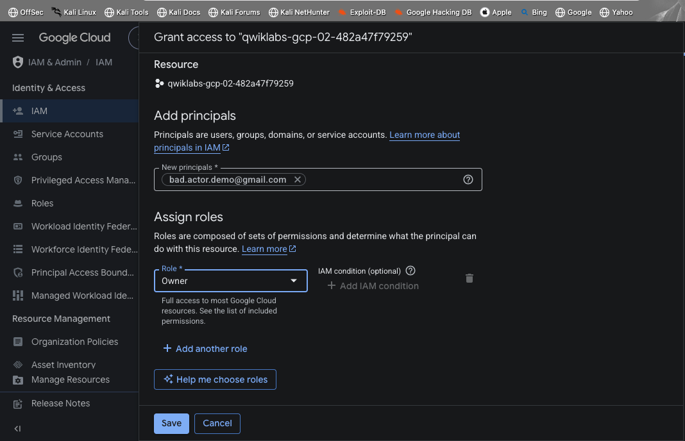
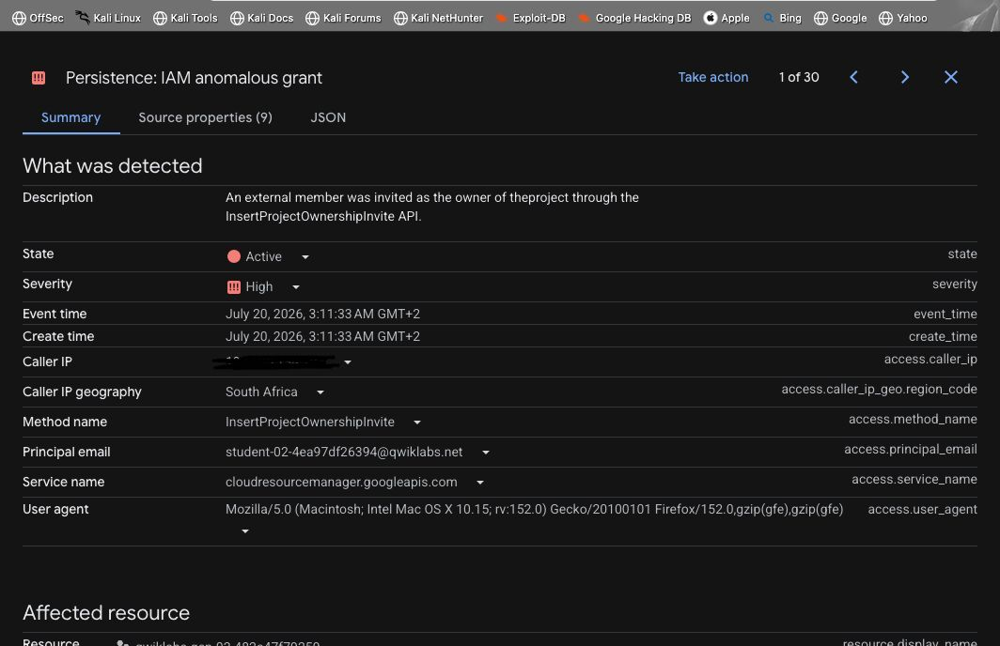
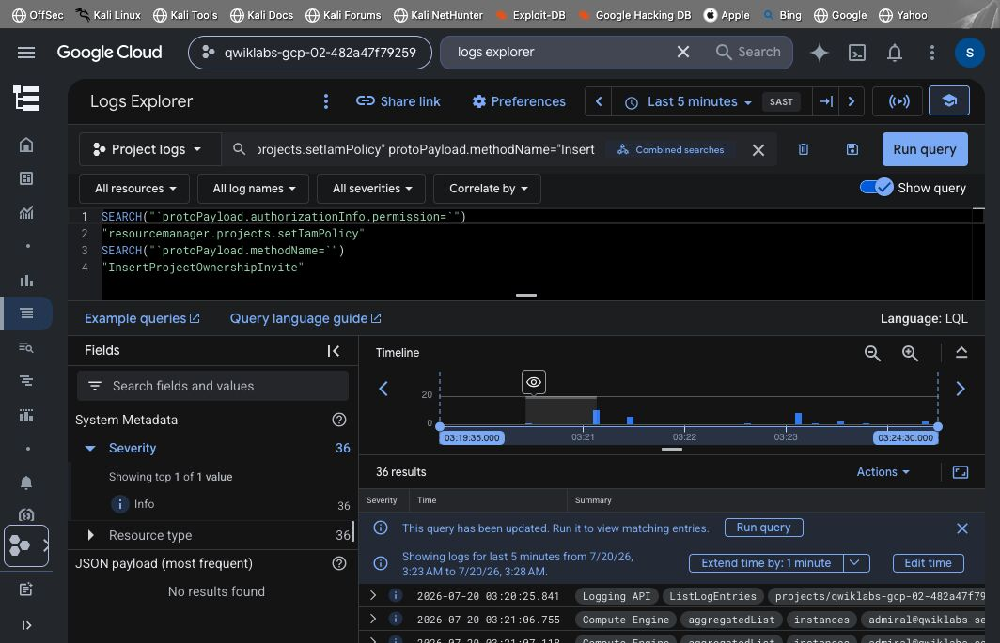
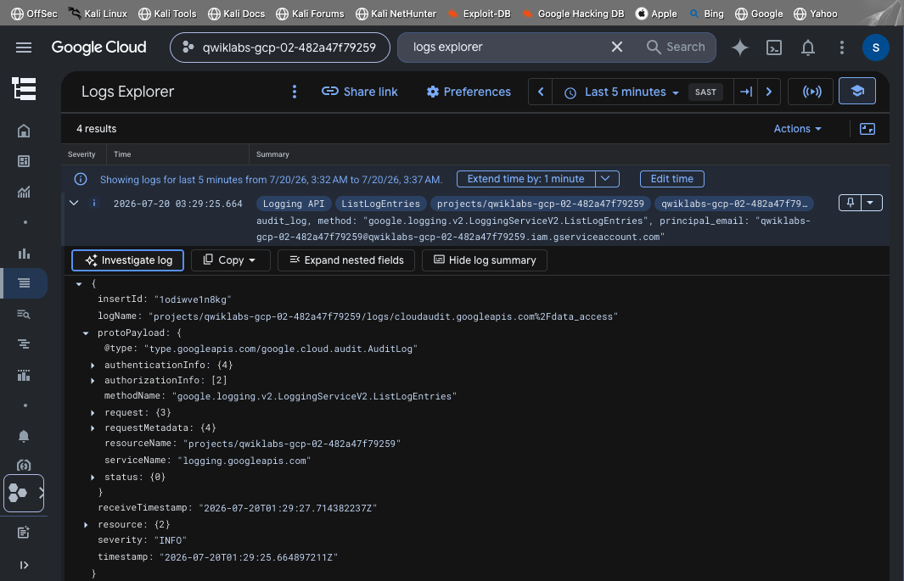
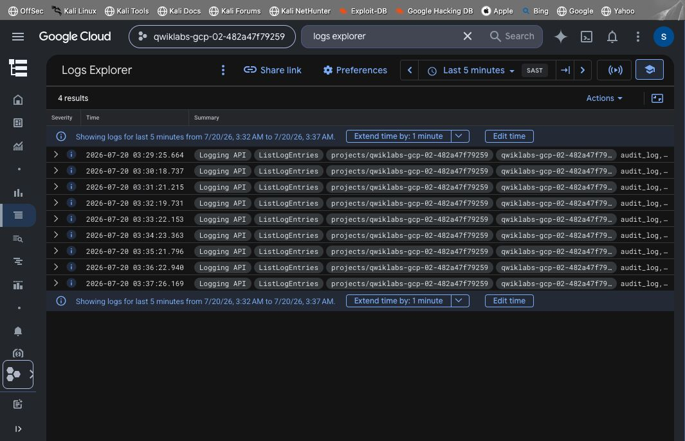

# Threat Hunting in the Cloud: Investigating Identity Persistence in GCP

## Objective
Completed a hands-on incident response investigation focused on detecting and analyzing identity-based threats in Google Cloud Platform. In cloud environments, attackers don't just steal data — they try to establish persistence. This project walks through discovering a high-severity privilege escalation event and reconstructing the full attack timeline from raw audit logs.

## The Infiltration Point
Identified a configuration vulnerability within IAM & Admin: an unauthorized external email address (`bad.actor.demo@gmail.com`) was explicitly granted the most destructive role possible in GCP — **Owner** — giving full access to nearly all project resources.

## Detection via Security Command Center
Google Cloud's Security Command Center automatically flagged the behavior as a **High Severity** finding under the category **Persistence: IAM anomalous grant**.

Key details isolated by SCC:
| Field | Value |
|---|---|
| Description | An external member was invited as the owner of the project through the `InsertProjectOwnershipInvite` API |
| Severity | High |
| Caller IP | 197.185.134.193 (South Africa) |
| Method name | `InsertProjectOwnershipInvite` |
| Principal email | `student-02-4ea97df26394@qwiklabs.net` |
| Service name | `cloudresourcemanager.googleapis.com` |

This confirmed both **when** the grant happened and **which compromised principal** was used to issue it.

## Pivoting to Forensics — Logs Explorer
To prove exactly how this happened, moved to Logs Explorer and built a targeted LQL (Logging Query Language) query to isolate the exact attacker action out of thousands of normal events:

This query filters specifically for IAM policy changes made via the ownership-invite API — cutting through routine audit noise to surface only the relevant identity events.

## Root Cause Analysis
Expanded the JSON payload of the matching log entry to extract hard evidence for incident documentation:
- Confirmed the exact **caller IP** used to issue the grant
- Confirmed the **method name** used to bypass standard role-assignment workflows
- Identified the **compromised principal email** abused to authorize the malicious grant

## Query Validation
Re-ran the targeted LQL query to confirm it reliably isolates the malicious action — validating that the forensic query works correctly to surface hidden identity threats, not just this specific instance.

## Findings
- Confirmed unauthorized privilege escalation via external IAM Owner grant
- Root-caused the attack path to a specific compromised principal account
- Built a reusable LQL detection query for `InsertProjectOwnershipInvite` abuse — a pattern that could be turned into a standing detection rule

## Skills Demonstrated
- Cloud IAM security analysis
- Threat detection via Security Command Center
- Log analysis and query writing (LQL) in Google Cloud Logs Explorer
- Incident timeline reconstruction from raw audit logs
- Root cause analysis and forensic documentation

## Screenshots

**Unauthorized IAM grant — the infiltration point**

**SCC finding — High severity anomalous grant detected**

**LQL query in Logs Explorer — pivoting to forensics**

**JSON payload analysis — root cause evidence**

**Query validation confirming the detection**

